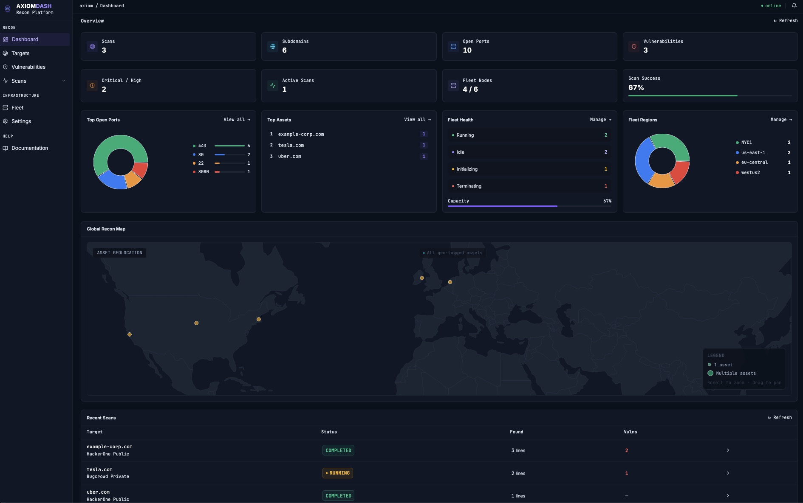
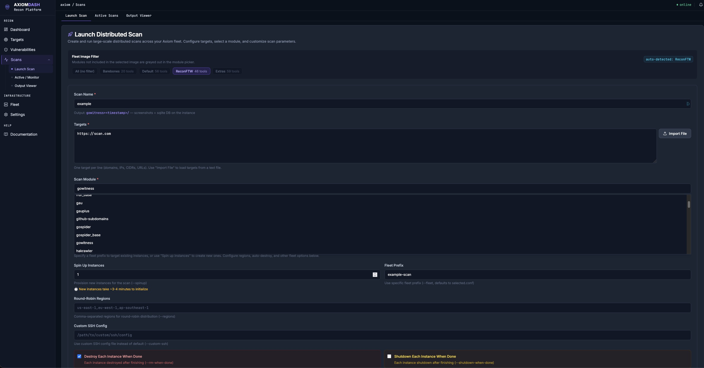
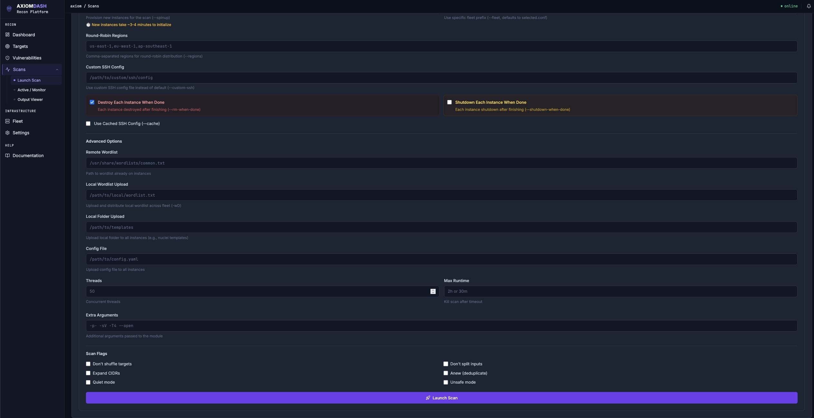
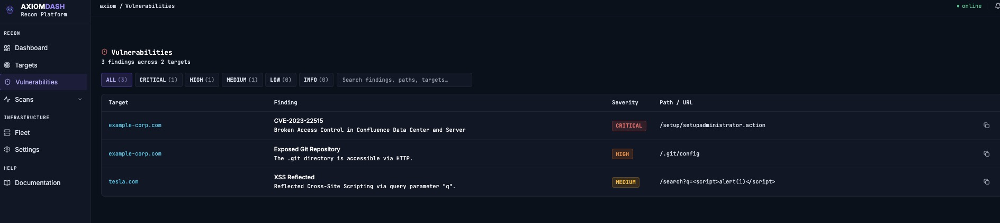
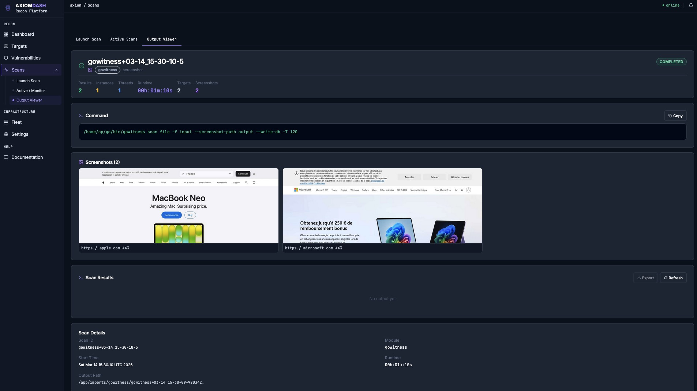
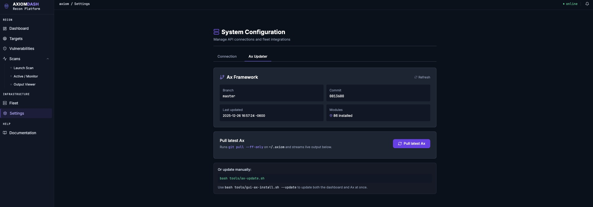

# GUI-AX — Dashboard for the Ax Recon Framework

[](https://opensource.org/licenses/MIT)
[](https://nodejs.org/)
[](https://python.org/)

A React + Flask dashboard for [Ax](https://github.com/attacksurge/ax) — the distributed cloud reconnaissance framework. Turns Ax's CLI tools into a real-time web UI for managing fleets, launching scans, and exploring results.

## 

> **⚠️ Tested Environment:** This dashboard has been developed and tested exclusively with **AWS** as the cloud provider. Other providers (DigitalOcean, Azure, Linode, GCP, etc.) are supported by Ax and should work, but have not been verified with this dashboard. If you encounter provider-specific issues, please open an issue.

---

## 🚦 Quick Start — from zero to first scan

> **New to Ax too?** Follow every step. Already have Ax configured? Jump to [step 3](#3-start-the-dashboard).

> **Want to see the full installation processes manually or using Docker** checkout [Installation](#Installation).

### 1. Install everything with one command

Run this on your Linux or macOS machine:

```bash
bash <(curl -fsSL https://raw.githubusercontent.com/PaulDHaes/GUI-AX-framework/main/tools/gui-ax-install.sh)
```

The installer will walk you through:

- Installing Node.js ≥ 18 and Python ≥ 3.9 if missing
- Cloning **Ax** to `~/.axiom` and running `axiom-configure` to connect your cloud account (DigitalOcean, AWS, Azure, Linode, etc.)
- Cloning this dashboard to `~/gui-ax-framework`
- Installing all dependencies (`npm install`, `pip install flask flask-cors`)
- Creating a `.env` config file

If you want to **skip Ax setup** and just install the dashboard:

```bash
bash <(curl -fsSL https://raw.githubusercontent.com/PaulDHaes/GUI-AX-framework/main/tools/gui-ax-install.sh) --skip-ax
```

---

### 2. Configure your cloud provider (first time only)

If the installer ran `axiom-configure` for you, this is already done. If you skipped it:

```bash
axiom-configure --run
```

This sets up your cloud API key and SSH key so Ax can provision instances. See the [Ax docs](https://github.com/attacksurge/ax) for provider-specific instructions.

Once configured, test it:

```bash
# Spin up a small test fleet (1 instance)
axiom-fleet myfleet -i 1

# Confirm it appeared
axiom-ls

# Tear it down
axiom-rm myfleet\* -f
```

---

### 3. Start the dashboard

```bash
cd ~/gui-ax-framework
bash tools/start-dev.sh
```

This starts both the Flask bridge (port **5000**) and the Vite UI (port **3000**) together.

Open **http://localhost:3000** in your browser.

The dashboard auto-connects to `http://localhost:5000` by default. Go to **Settings** to verify the health check shows ✅ _Bridge is reachable_.

> **🐳 Docker / Remote users:** Both ports **3000** (UI) and **5000** (bridge API) must be exposed and accessible. If running inside Docker, map both ports: `-p 3000:3000 -p 5000:5000`. If running on a remote server, ensure both ports are open in your firewall / security group.

---

### 4. Provision a fleet & run your first scan

1. Go to **Fleet Manager** → click **Initialise Fleet**, choose a size (start with 3 instances)
2. Wait for instances to go green (~60 seconds)
3. Go to **Scan Launcher** → pick a module (e.g. `httpx`), paste your targets, click **Launch**
4. Watch live progress in **Active Scans**
5. Click any completed scan to view results — structured tables, screenshot gallery, and raw logs

> **💡 How scans run:** Each scan launches in its own **tmux session** on the bridge server. This means scans keep running even if you close the browser. To manually inspect a running scan, attach to its tmux session: `tmux ls` to list sessions, then `tmux attach -t <session-name>`. The dashboard's Active Scans page polls the bridge for status updates automatically.

---

### 5. Keep Ax up to date

Ax releases frequent updates with new modules and bug fixes. Update from the dashboard:

**Settings → Ax Updater → Pull latest Ax**

Or from the terminal:

```bash
ax update
```

---

## What it does

### 🚀 Scan Launcher

Launch distributed scans across your entire cloud fleet with a few clicks. Pick a module (nuclei, amass, nmap, httpx, ffuf, …), enter your targets, configure options, and fire. The UI shows which tools are available per provisioner image (barebones, default, reconftw, etc.) so you only see what's actually installed on your fleet.

## 

## 

> **Tested modules:** The following modules have been verified end-to-end with this dashboard: `nuclei`, `amass`, `subfinder`, `httpx`, `nmap`, `naabu`, `ffuf`, `gowitness`, `dnsx`, `whois`, and `masscan`. Other Ax modules should work but may not have structured output parsing — results will still appear as raw log lines.

### 🖥️ Fleet Manager

View and control every instance in your Ax fleet — provider, region, IP, status, specs, and cost. Power instances on/off, SSH in, run commands across the whole fleet, or delete instances directly from the UI. Supports DigitalOcean, AWS, Azure, Linode, and more.

### 📊 Active Scans

Real-time monitor for running `axiom-scan` jobs. See live progress, elapsed time, and output as it arrives. Cancel scans from the dashboard. Scans that fail due to missing tools or bad container images are clearly flagged as **failed** with the reason extracted from logs — no more false "completed" statuses.

Each scan runs in a dedicated **tmux session** so it persists independently of the browser. You can attach to any running scan's tmux session from the terminal (`tmux attach -t <scan-session>`) for direct log access.

### 🔍 Per-scan Output Viewer

## 

## 

Deep-dive into any individual scan result:

- **Screenshot gallery** — tall image cards (with lightbox) for gowitness / webscreenshot / aquatone scans
- **Structured tables** — HTTP results (status code · URL · title), port results (port · state · service), vulnerability results (severity · template · target)
- **Smart filter chips** — filter by HTTP status code, nuclei severity, or nmap port state with a single click
- **Full-text search** — search across all raw log lines
- **Failure banner** — red alert with the exact log lines that caused the failure if a scan went wrong

### 📁 Auto-Import & Target Database

Drop scan output into `imports/` and the bridge auto-parses it. Results land in a searchable target database with subdomains, open ports, vulnerabilities, whois data, and HTTP info — all merged per target even when sourced from multiple tools.

Supported formats imported automatically:
| Tool | Format |
|------|--------|
| nuclei | JSON |
| amass | JSON / plain text |
| nmap | XML |
| nmapx | XML |
| httpprobe | plain |
| httpx | JSON |
| dnsx | JSON / plain text |
| subfinder | JSON |
| whois | plain text (`.dir` batch folders) |
| gowitness | sqlite |
| ffuf | JSON |

### ✅ Tested Modules & Provider

| Aspect                      | Details                                                                                                                                 |
| --------------------------- | --------------------------------------------------------------------------------------------------------------------------------------- |
| **Cloud provider**          | AWS (tested) — other Ax-supported providers should work but are unverified                                                              |
| **Scan modules (verified)** | `nuclei`, `amass`, `subfinder`, `httpx`, `nmap`, `naabu`, `ffuf`, `gowitness`, `dnsx`, `whois`, `masscan`                               |
| **Import parsers**          | nuclei (JSON), amass (JSON/txt), nmap (XML), httpx (JSON), ffuf (JSON), gowitness (txt), subfinder (JSON), dnsx (JSON/txt), whois (dir) |
| **Scan execution**          | Each scan runs in a dedicated **tmux session** — survives browser close, attachable from terminal                                       |

### 🗺️ Geographic Map

D3 world map showing where whois-registered entities are located. Dots are colour-coded green → yellow → red by entity count per country. Zoom-invariant — dots stay readable at any zoom level.

### 🔗 Topology Graph

D3 force-directed graph of a target's attack surface: domain → subdomains → open ports, rendered interactively.

### 🤖 Risk Analysis

Built-in local risk scoring for targets based on vulnerability severity, open port count, and attack surface size. Provides a 0–10 risk score with prioritised remediation guidance — no external API key required.

### 🔄 Ax Framework Updater

Keep Ax in sync from the dashboard — a dedicated Settings tab shows the current Ax version and lets you pull the latest changes to `~/.axiom` with a single click. The bridge streams git output in real time so you can watch the update happen.

## 

---

## Architecture

```
┌────────────────────────────────────────────┐
│         React / TypeScript  (Vite)         │
│  Fleet · Scans · Map · Targets · AI panel  │
└───────────────────┬────────────────────────┘
                    │  REST  (localhost:5000)
                    ▼
┌────────────────────────────────────────────┐
│         axiom-bridge.py  (Flask)           │
│  • Ax CLI executor (axiom-scan / ls / exec)│
│  • imports/ watcher  →  auto-parse results │
│  • Result normaliser + persistent store    │
│  • DELETE / target management endpoints    │
└───────────────────┬────────────────────────┘
                    │
                    ▼
┌────────────────────────────────────────────┐
│           Ax framework  (~/.axiom)         │
│      axiom-scan · axiom-ls · axiom-exec    │
└───────────────────┬────────────────────────┘
                    │
                    ▼
┌────────────────────────────────────────────┐
│  Cloud fleet  (AWS tested · DO/Azure/GCP/  │
│  Linode/Hetzner/IBM/Scaleway/Exoscale)     │
└────────────────────────────────────────────┘
```

---

## Installation

### One-liner (recommended)

```bash
bash <(curl -fsSL https://raw.githubusercontent.com/PaulDHaes/GUI-AX-framework/main/tools/gui-ax-install.sh)
```

The installer will:

1. Check / install system dependencies (git, Node.js ≥ 18, Python ≥ 3.9)
2. Offer to install the **Ax framework** itself (`~/.axiom`) — full setup or clone-only
3. Clone this repo to `~/gui-ax-framework`
4. Run `npm install` and `pip install flask flask-cors`
5. Generate a `.env` config (ports, optional Gemini key)
6. Optionally create a systemd service (Linux)

**Flags:**

```
--skip-ax          Dashboard only, don't touch Ax
--unattended       Silent install with all defaults
--update           Pull latest changes for both repos
--dir <path>       Custom install directory
--port <port>      Bridge API port  (default 5000)
--ui-port <port>   UI port          (default 3000)
```

---

### Manual install

**Prerequisites:** Node.js ≥ 18, Python ≥ 3.9, git, and [Ax](https://github.com/attacksurge/ax) installed & configured.

```bash
# 1. Clone
git clone https://github.com/PaulDHaes/GUI-AX-framework ~/gui-ax-framework
cd ~/gui-ax-framework

# 2. Frontend dependencies
npm install

# 3. Backend dependencies
pip3 install flask flask-cors

# 4. Config (copy and edit)
cp .env.example .env
```

---

### Docker install (all-in-one)

Run everything — Ax framework + dashboard — inside a single Docker container. No need to install Ax on your host. This is the same approach as the [official Ax Docker install](https://github.com/attacksurge/ax?tab=readme-ov-file#docker), with the dashboard added on top.

```bash
# 1. Clone the dashboard
git clone https://github.com/PaulDHaes/GUI-AX-framework ~/gui-ax-framework
cd ~/gui-ax-framework

# 2. Build and start
docker compose up --build -d

# 3. Open a shell in the container (auto-prompts axiom-configure on first run)
docker exec -it gui-ax-dashboard zsh
```

**First run:** When you open a shell, it detects Ax isn't configured yet and prompts you to run `axiom-configure --run` — the same interactive setup flow as a fresh Ax install (select cloud provider, enter API keys, build Packer image). The dashboard is already running in the background.

**Subsequent runs:** Ax is already configured, so you get dropped straight into a zsh shell with a status summary. The dashboard is running in tmux.

Once running:

- **http://localhost:3000** — Dashboard UI
- **http://localhost:5000** — Bridge API

**Inside the container:**

Everything lives inside the container — Ax at `/root/.axiom`, dashboard at `/app`. The dashboard runs in a tmux session called `dashboard` with two windows (bridge + Vite). Scans launch in their own tmux sessions, just like a native install.

```bash
# Open a shell (zsh, same as official Ax Docker)
docker exec -it gui-ax-dashboard zsh

# View the dashboard logs
tmux attach -t dashboard

# List all tmux sessions (dashboard + any running scans)
tmux ls

# Run Ax commands directly — everything is on PATH
axiom-ls
axiom-fleet myfleet -i 3
axiom-scan ...
```

**What persists across container restarts:**

| Docker volume | Mounts to   | Contents                             |
| ------------- | ----------- | ------------------------------------ |
| `gui-ax-data` | `/app/data` | Target store (imported scan results) |

> **Note:** Ax config (cloud accounts, SSH keys, Packer images) lives inside the container. If you remove the container (`docker compose down`), you'll need to re-run `axiom-configure --run`. Use `docker compose stop` / `docker compose start` to preserve everything.

To stop / restart / reset:

```bash
docker compose stop          # stop without removing (preserves Ax config)
docker compose start         # restart a stopped container
docker compose down          # remove container (Ax config lost, data volume kept)
docker compose down -v       # full reset — wipes everything
```

---

## Running

```bash
# Start the Flask bridge  (terminal 1)
python3 tools/axiom-bridge.py

# Start the Vite UI       (terminal 2)
npm run dev
```

Or both at once:

```bash
bash tools/start-dev.sh
```

Or with Docker:

```bash
docker compose up --build
```

| Service    | Default URL           |
| ---------- | --------------------- |
| Dashboard  | http://localhost:3000 |
| Bridge API | http://localhost:5000 |

> **Note:** Scans are launched in **tmux sessions** by the bridge. Make sure `tmux` is installed on the machine running the bridge (`brew install tmux` on macOS, `apt install tmux` on Linux). List active scan sessions with `tmux ls`.

---

## Configuration

Create a `.env` file in the repo root (the installer does this for you, or copy from `.env.example`):

```env
# Optional — enables the Gemini AI panel
GEMINI_API_KEY=your_key_here

# Flask bridge port
PORT=5000

# Override data/import paths (defaults are relative to repo root)
# STORE_PATH=./data/axiom_bridge_store.json
# IMPORTS_PATH=./imports
```

| Variable         | Default                          | Description                                    |
| ---------------- | -------------------------------- | ---------------------------------------------- |
| `GEMINI_API_KEY` | _(blank)_                        | Google Gemini key — AI panel disabled if unset |
| `PORT`           | `5000`                           | Flask bridge port                              |
| `STORE_PATH`     | `./data/axiom_bridge_store.json` | Persistent target store                        |
| `IMPORTS_PATH`   | `./imports`                      | Directory watched for scan results             |

---

## Importing scan results

Drop scan output into `imports/` and the bridge picks it up automatically:

```
imports/
├── nuclei-output.jsonl        # Nuclei JSONL
├── amass-output.json          # Amass JSON / txt
├── nmap-scan.xml              # Nmap XML
├── httpx-results.jsonl        # HTTPx JSONL
├── dnsx-results.txt           # DNSx plain text
├── whois+02-26_23-34.dir/     # Whois batch folder (axiom-scan output)
│   ├── example.com
│   ├── target.org
│   └── ...
└── processed/                 # Auto-moved after import
```

Parsed results merge into the target database — multiple tool outputs for the same domain are combined into one target entry.

---

## Project structure

```
gui-ax-framework/
├── components/
│   ├── FleetManager.tsx     # Instance list, power, SSH, delete
│   ├── FleetControl.tsx     # Fleet-wide exec & control
│   ├── ScanLauncher.tsx     # Scan builder (module, targets, fleet)
│   ├── ActiveScans.tsx      # Live scan monitor (with failure detection)
│   ├── ScanOutput.tsx       # Per-scan output: tables, screenshot gallery, filters
│   ├── GeoMap.tsx           # D3 world map (whois geo dots)
│   ├── TopologyGraph.tsx    # D3 attack-surface graph
│   ├── Settings.tsx         # App settings + Ax updater
│   └── ui/                  # shadcn/ui primitives
├── services/
│   └── axiomProvider.ts     # Bridge API client / state provider
├── tools/
|   |── importers/
|       |── import_gowitness.py # Import Gowitness data
|       |── import_nuclei.py    # Import Nuclei data
|       └── import_....py       # Import all other data
│   ├── axiom-bridge.py      # Flask API + file watcher (main backend)
│   ├── gui-ax-install.sh    # One-liner installer
│   ├── ax-update.sh         # Pull latest Ax framework (~/.axiom)
│   ├── start-dev.sh         # Start bridge + UI together
│   └── docker-entrypoint.sh # Docker container entrypoint
├── Dockerfile               # Container image build
├── docker-compose.yml       # One-command Docker startup
├── imports/                 # Drop scan output here
│   └── processed/           # Auto-moved after import
├── data/                    # Persistent JSON store (git-ignored)
├── .env.example             # Environment variable template
└── .env                     # Your config (not committed)
```

---

## Bridge API reference

Key endpoints exposed by `axiom-bridge.py`:

| Method   | Path                                   | Description                         |
| -------- | -------------------------------------- | ----------------------------------- |
| `GET`    | `/health`                              | Health check                        |
| `GET`    | `/api/axiom/fleet`                     | List all instances                  |
| `POST`   | `/api/axiom/fleet/power`               | Power on/off instance               |
| `DELETE` | `/api/axiom/fleet/<name>`              | Delete instance                     |
| `GET`    | `/api/axiom/modules`                   | List scan modules                   |
| `POST`   | `/api/axiom/scan`                      | Launch a new scan                   |
| `GET`    | `/api/axiom/scans`                     | List all scans                      |
| `GET`    | `/api/axiom/scans/filesystem/discover` | Discover scans from filesystem      |
| `GET`    | `/api/axiom/scans/<id>`                | Get scan details + failure info     |
| `GET`    | `/api/axiom/scans/<id>/output`         | Raw scan log output                 |
| `DELETE` | `/api/axiom/scans/<id>`                | Delete a scan                       |
| `GET`    | `/api/axiom/scans/<id>/screenshots`    | List screenshot paths for scan      |
| `GET`    | `/api/axiom/scans/<id>/img/<path>`     | Serve screenshot image              |
| `GET`    | `/api/axiom/targets`                   | List all targets                    |
| `DELETE` | `/api/axiom/targets/<id>`              | Delete a target                     |
| `GET`    | `/api/axiom/update`                    | Stream Ax framework git pull output |
| `GET`    | `/api/axiom/vuln`                      | List all vulnerabilties             |
| `GET`    | `/api/axiom/docs`                      | Get information what this can do    |


---

## Keeping Ax up to date

The dashboard and Ax are two separate projects. Use any of these methods to keep Ax current:

### Option A — Settings UI (easiest)

Open **Settings → Ax Updater** in the dashboard and click **Pull latest Ax**. The bridge runs `git pull` on `~/.axiom` and streams the output live.

### Option B — Update script

```bash
bash tools/ax-update.sh
```

Pulls the latest Ax, re-sources PATH, and optionally restarts the bridge.

### Option C — Installer `--update` flag

```bash
bash tools/gui-ax-install.sh --update
```

Updates both the dashboard repo **and** Ax in one shot.

### Option D — Manual git

```bash
git -C ~/.axiom pull --ff-only origin main
```

---

## Related

- [Ax](https://github.com/attacksurge/ax) — distributed cloud recon framework

## Contributing

See [CONTRIBUTING.md](CONTRIBUTING.md) for development setup, branch naming conventions, and the PR process.

## Security

Found a vulnerability? Please read [SECURITY.md](SECURITY.md) before opening a public issue.

## License

MIT — see [LICENSE](LICENSE) for details.
