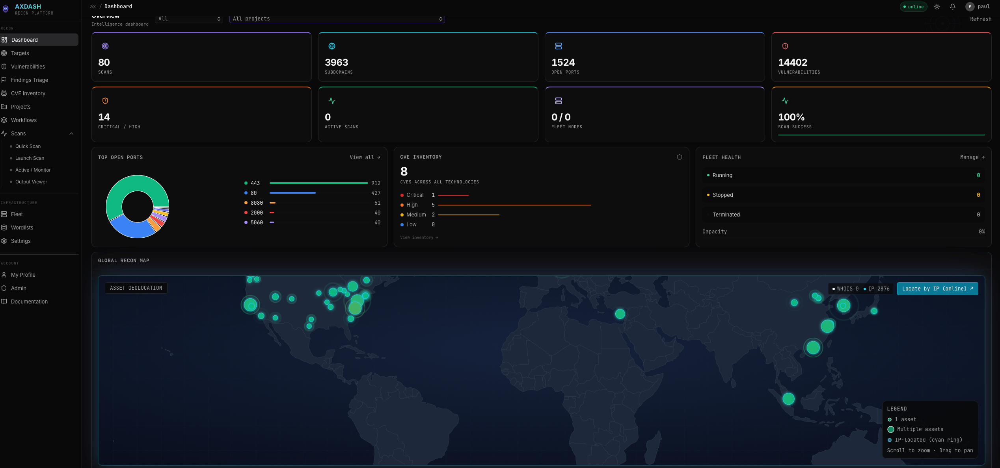
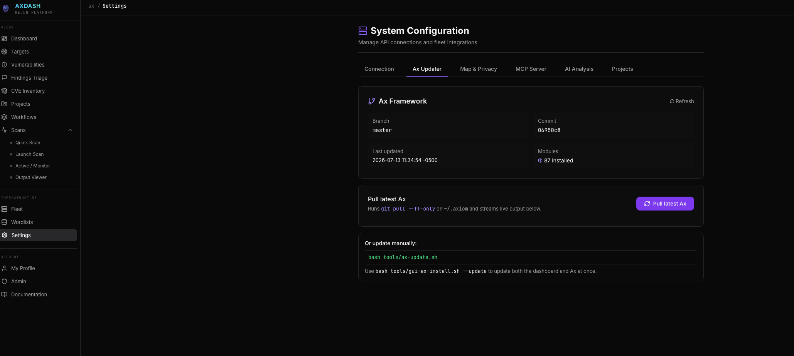
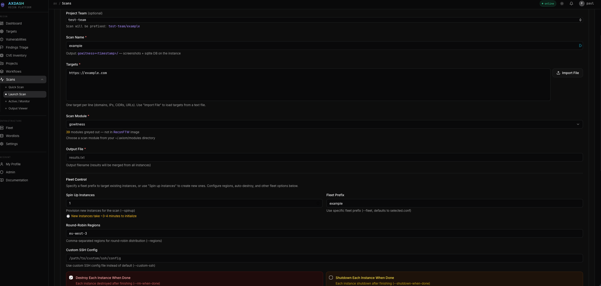
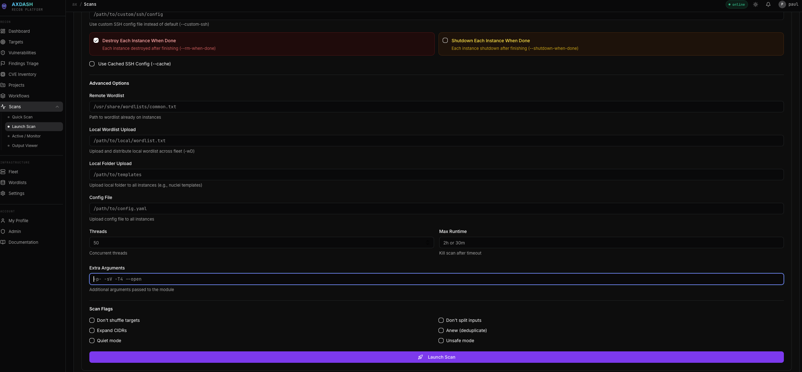
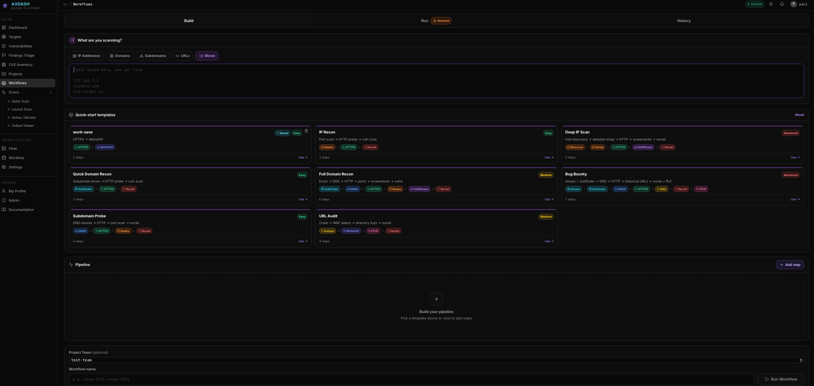
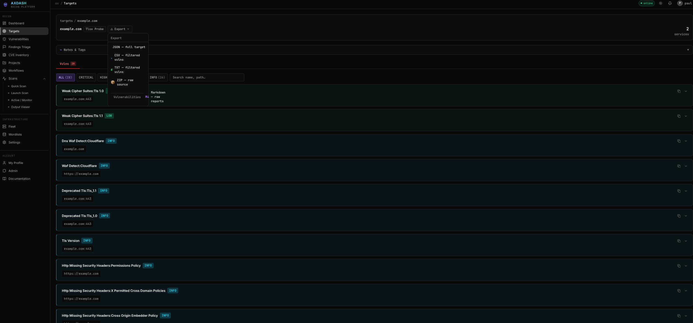
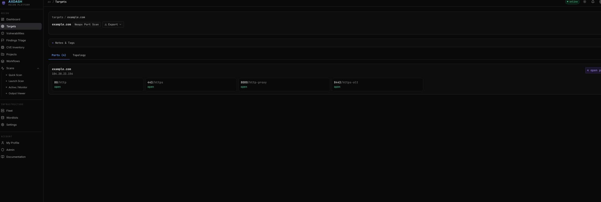
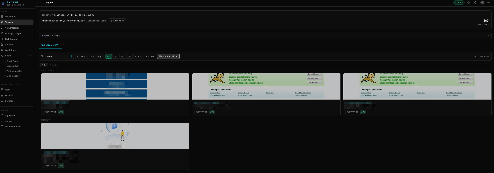

# GUI-AX — Dashboard for the Ax Recon Framework

[](https://opensource.org/licenses/MIT)
[](https://nodejs.org/)
[](https://python.org/)

A React + Flask dashboard for [Ax](https://github.com/attacksurge/ax) — the distributed cloud reconnaissance framework. It turns Ax's CLI tools into a real-time web UI for the whole recon loop:

- **Run recon at scale.** Manage cloud fleets, launch single scans or multi-step workflows, and watch them live.
- **Review results.** Everything lands in one target database: hosts, ports, web screenshots, vulnerabilities and detected technologies.
- **Prioritise.** Findings triage with false-positive marking, a CVE inventory that flags actively exploited (CISA KEV) CVEs and ones with public PoCs, SearchSploit lookups, and optional AI analysis.
- **Work per engagement.** Projects, multi-user teams, and integration with Specterops [Ghostwriter](https://github.com/GhostManager/Ghostwriter) and AI tools over MCP.

## 

> **⚠️ Tested Environment:** This dashboard has been developed and tested exclusively with **AWS** as the cloud provider. Other providers (DigitalOcean, Azure, Linode, GCP, etc.) are supported by Ax and should work, but have not been verified with this dashboard. If you encounter provider-specific issues, please open an issue.

---

## 🚦 Quick Start — from zero to first scan

> **New to Ax too?** Follow every step. Already have Ax configured? Jump to [step 3](#3-start-the-dashboard).

> **Want to see the full installation processes manually or using Docker** checkout [Installation](#Installation).

### 1. Install everything with one command

Run this on your Linux or macOS machine:

```bash
bash <(curl -fsSL https://raw.githubusercontent.com/PaulDHaes/GUI-AX-framework/main/tools/gui-ax-install.sh)
```

The installer will walk you through:

- Installing Node.js ≥ 18 and Python ≥ 3.9 if missing
- Cloning **Ax** to `~/.axiom` and running `axiom-configure` to connect your cloud account (DigitalOcean, AWS, Azure, Linode, etc.)
- Cloning this dashboard to `~/gui-ax-framework`
- Installing all dependencies (`npm install`, `pip install flask flask-cors`)
- Creating a `.env` config file

If you want to **skip Ax setup** and just install the dashboard:

```bash
bash <(curl -fsSL https://raw.githubusercontent.com/PaulDHaes/GUI-AX-framework/main/tools/gui-ax-install.sh) --skip-ax
```

---

### 2. Configure your cloud provider (first time only)

If the installer ran `axiom-configure` for you, this is already done. If you skipped it:

```bash
axiom-configure --run
```

This sets up your cloud API key and SSH key so Ax can provision instances. See the [Ax docs](https://github.com/attacksurge/ax) for provider-specific instructions.

Once configured, test it:

```bash
# Spin up a small test fleet (1 instance)
axiom-fleet myfleet -i 1

# Confirm it appeared
axiom-ls

# Tear it down
axiom-rm myfleet\* -f
```

---

### 3. Start the dashboard

```bash
cd ~/gui-ax-framework
bash tools/start-dev.sh
```

This starts both the Flask bridge (port **5000**) and the Vite UI (port **3000**) together.

Open **http://localhost:3000** in your browser.

The dashboard auto-connects to `http://localhost:5000` by default. Go to **Settings** to verify the health check shows ✅ _Bridge is reachable_.

> **🐳 Docker / Remote users:** Both ports **3000** (UI) and **5000** (bridge API) must be exposed and accessible. If running inside Docker, map both ports: `-p 3000:3000 -p 5000:5000`. If running on a remote server, ensure both ports are open in your firewall / security group.

---

### 4. Provision a fleet & run your first scan

1. Go to **Fleet Manager** → click **Initialise Fleet**, choose a size (start with 3 instances)
2. Wait for instances to go green (~60 seconds)
3. Go to **Scan Launcher** → pick a module (e.g. `httpx`), paste your targets, click **Launch**
4. Watch live progress in **Active Scans**
5. Click any completed scan to view results — structured tables, screenshot gallery, and raw logs

> **💡 How scans run:** Each scan launches in its own **tmux session** on the bridge server. This means scans keep running even if you close the browser. To manually inspect a running scan, attach to its tmux session: `tmux ls` to list sessions, then `tmux attach -t <session-name>`. The dashboard's Active Scans page polls the bridge for status updates automatically.

---

### 5. Keep Ax up to date

Ax releases frequent updates with new modules and bug fixes. Update from the dashboard:

**Settings → Ax Updater → Pull latest Ax**

Or from the terminal:

```bash
ax update
```

## 

## What it does

The sidebar groups every page into **Recon** (Dashboard, Targets, Vulnerabilities, Findings Triage, CVE Inventory, Projects, Workflows, and a **Scans** group), **Infrastructure** (Fleet, Wordlists, Settings), and **Account** (My Profile, Admin, Documentation). The sections below cover each area.

### 🗂️ Projects & the active project

Recon work is organised into **projects**. Pick one as your **active project** on the Projects page and the Dashboard, Vulnerabilities, Findings Triage, and CVE Inventory pages all default their project filter to it — so you see one engagement at a time without re-selecting it on every page. You can always switch a page's filter back to _All projects_. Projects also link to the scans that belong to them (scans labelled `gw-<client>-…` map to a project automatically), and the active project is stored server-side per user, so it follows you across devices.

### 🚀 Scan Launcher & Quick Scan

Launch distributed scans across your entire cloud fleet with a few clicks. Pick a module (nuclei, amass, nmap, httpx, ffuf, …), enter your targets, configure options, and fire. The UI shows which tools are available per provisioner image (barebones, default, reconftw, etc.) so you only see what's actually installed on your fleet.

The **Scans** group in the sidebar holds four views: **Quick Scan** (a streamlined single-target form — enter a target, pick from a short module list like httpx/nuclei/subfinder/dnsx/gowitness/katana/ffuf/waybackurls, and go), **Launch Scan** (the full module builder), **Active / Monitor**, and **Output Viewer**.

## 

## 

> **Tested modules:** The following modules have been verified end-to-end with this dashboard: `nuclei`, `amass`, `subfinder`, `httpx`, `nmap`, `naabu`, `ffuf`, `gowitness`, `dnsx`, `whois`, and `masscan`. Other Ax modules should work but may not have structured output parsing — results will still appear as raw log lines.

### 🧩 Workflow Builder

## 

Chain scans into automated pipelines instead of launching each module by hand. The Workflow Builder is a **DAG (directed-acyclic-graph) pipeline editor** — you add modules as steps and link them together, and the output of each step is fed automatically into the next. No more copying files between tools or dropping output into `imports/` by hand.

- **Sequential, parallel & fan-in steps** — link a step to one parent to run it after that step completes, leave it unlinked to run it as a parallel root, or give it multiple parents to join several branches (fan-in). Classic recon chain:

  ```
  subfinder  →  httpx (live host filter)  →  nuclei
                                         ↘  gowitness
  ```

- **AMI-aware module picker** — like the Scan Launcher, the builder only offers modules that are actually baked into your fleet's provisioner image (barebones / default / reconftw / extras). Unavailable modules are greyed out with a badge showing which image would provide them, so you can't build a pipeline your fleet can't run.
- **Saveable custom templates** — build a pipeline once, click **Save as template**, and it's stored (in your browser's `localStorage`) alongside the built-in playbooks. Custom templates round-trip the full branch structure, so reloading one restores every sequential/parallel/fan-in link exactly. Delete them from the template gallery when you're done.
- **Built-in playbooks** — a set of ready-made linear pipelines you can load and tweak as a starting point.
- **Backend step sequencer** — pipelines are executed by `tools/workflow-runner.py`, which topologically sorts the steps, groups them into execution "waves", launches each module via the bridge, waits for real completion, and passes structured output downstream. The UI polls run status live and shows per-step progress, logs, and an abort button.

### 🖥️ Fleet Manager

View and control every instance in your Ax fleet — provider, region, IP, status, specs, and cost. Power instances on/off, SSH in, run commands across the whole fleet, or delete instances directly from the UI. Supports DigitalOcean, AWS, Azure, Linode, and more.

### 📊 Active Scans

Real-time monitor for running `axiom-scan` jobs. See live progress, elapsed time, and output as it arrives. Cancel scans from the dashboard. Scans that fail due to missing tools or bad container images are clearly flagged as **failed** with the reason extracted from logs — no more false "completed" statuses.

Each scan runs in a dedicated **tmux session** so it persists independently of the browser. You can attach to any running scan's tmux session from the terminal (`tmux attach -t <scan-session>`) for direct log access.

### 🔍 Per-scan Output Viewer

## 

## 

## 

Deep-dive into any individual scan result:

- **Screenshot gallery** — tall image cards (with lightbox) for gowitness / webscreenshot / aquatone scans
- **Structured tables** — HTTP results (status code · URL · title), port results (port · state · service), vulnerability results (severity · template · target)
- **Smart filter chips** — filter by HTTP status code, nuclei severity, or nmap port state with a single click
- **Full-text search** — search across all raw log lines
- **Failure banner** — red alert with the exact log lines that caused the failure if a scan went wrong

### 📁 Auto-Import & Target Database

Drop scan output into `imports/` and the bridge auto-parses it. Results land in a searchable target database with subdomains, open ports, vulnerabilities, whois data, and HTTP info — all merged per target even when sourced from multiple tools.

Supported formats imported automatically:
| Tool | Format |
|------|--------|
| nuclei | JSON |
| amass | JSON / plain text |
| nmap | XML |
| nmapx | XML |
| httpprobe | plain |
| httpx | JSON |
| dnsx | JSON / plain text |
| subfinder | JSON |
| whois | plain text (`.dir` batch folders) |
| gowitness | plain text |
| ffuf | JSON |

### ✅ Tested Modules & Provider

| Aspect                      | Details                                                                                                                                 |
| --------------------------- | --------------------------------------------------------------------------------------------------------------------------------------- |
| **Cloud provider**          | AWS (tested) — other Ax-supported providers should work but are unverified                                                              |
| **Scan modules (verified)** | `nuclei`, `amass`, `subfinder`, `httpx`, `nmap`, `naabu`, `ffuf`, `gowitness`, `dnsx`, `whois`, `masscan`                               |
| **Import parsers**          | nuclei (JSON), amass (JSON/txt), nmap (XML), httpx (JSON), ffuf (JSON), gowitness (txt), subfinder (JSON), dnsx (JSON/txt), whois (dir) |
| **Scan execution**          | Each scan runs in a dedicated **tmux session** — survives browser close, attachable from terminal                                       |

### 🗺️ Geographic Map

D3 world map showing where your assets are located. Dots are colour-coded green → yellow → red by asset count, and stay readable at any zoom level. In light mode the map renders with a light blue ocean and blue-gray landmasses; in dark mode it switches to the dark ocean palette. It draws from **two independent geo sources**:

- **WHOIS** — the registrant country from whois scans, plotted at the country centroid (white ring).
- **IP geolocation** — forward-resolves every host and geolocates its IP to a **city-level** dot (cyan ring). Two providers:
  - **Locate by IP** (offline) — looks IPs up in a local **MaxMind GeoLite2** database. Fully private: no target IP ever leaves your machine. Hosts imported with an IP already present (from httpx/dnsx) are geolocated automatically on import.
  - **Online ↗** (no signup) — uses the free [ip-api.com](https://ip-api.com) service, so it works with **zero setup**. The trade-off: your target IPs are sent to a third party, and the free tier is HTTP with a ~15 req/min limit. Only ever runs when you click the button.

  Both cache results per IP, and the button DNS-resolves any hosts that don't yet have an IP.

> **Choosing a provider:** the offline route is the private default and appears whenever a database is present. To enable it, create a free [MaxMind account](https://www.maxmind.com/en/geolite2/signup), download **GeoLite2-City.mmdb**, drop it at `data/GeoLite2-City.mmdb` (or set `GEOIP_DB_PATH`), and install `geoip2` (bundled in the Docker image and installer). Don't want the signup? Just use **Online ↗** — no key or database needed.

> **Disabling online lookups:** if you'd rather never send IPs off-box, turn off **Settings → Map & Privacy → Allow online IP lookups**. The Online button disappears and only the offline provider is offered. (The offline auto-enrich on import never uses the network regardless.)

### 🎨 Themes

Two purpose-built design systems toggled with the sun/moon button in the top bar. Switching animates smoothly over 1 second — all colors cross-fade simultaneously and dashboard tiles bounce with a staggered spring pop.

**Light — Airtable editorial**
White canvas, near-black ink typography, white sidebar with colorful section labels (burnt-orange Recon, teal Infrastructure, amber Account). Dashboard stat tiles are solid-color blocks — each metric has its own fully opaque accent color (purple, cyan, blue, red, orange, emerald, amber, violet) with white text.

**Dark — Raycast developer-tools**
Pure near-black (#07080a) canvas, 1px hairline borders, white primary CTA. Each stat tile glows its own per-card accent color on hover rather than a generic blue.

### 🛡️ Vulnerabilities

A single list of every vulnerability across all targets, sorted by severity. Filter by severity chips, full-text search, and project, then **Export** the currently-filtered list as JSON, CSV, or TXT from the dropdown in the header. Clicking the "Vulnerabilities" or "Critical / High" stat cards on the Dashboard jumps straight here (the latter pre-filtered to critical).

### 🔎 Findings Triage

Consolidated review queue for every vulnerability and security finding across all targets — aggregated from `nuclei` output, CVE enrichment, and exploit references.

- **Stats bar** — live counts by severity (Critical / High / Medium / Low / Info) and total false positives
- **Filters** — debounced full-text search, severity dropdown, per-target filter, project filter (defaults to your active project), Show FPs toggle, Unique-only toggle (hides duplicate findings across targets)
- **Expanded row** — click any finding to see the full description, raw matched content, auto-fetched **CVE panel** (CVSS score + vector + NVD references), local **SearchSploit** results (exploitdb is bundled in the Docker image), and a **HackTricks** link
- **False-positive marking** — one-click FP toggle per finding; the flag is persisted to the bridge and survives page refreshes
- **Export CSV** — downloads all currently-visible findings (active filters apply) with columns: ID, Name, Severity, Target, Path, Matched, CVE, False Positive, Duplicate

### 🐛 CVE Inventory

Continuously matches the technologies and versions discovered across your targets against known CVEs, so you get a running vulnerability inventory without launching a scan for it.

- **NVD matching** — detected `product` + `version` pairs are matched to CVEs from the NVD (set an optional `NVD_API_KEY` to raise the rate limit)
- **cvelistV5 enrichment** — each CVE is enriched from the [CVEProject/cvelistV5](https://github.com/CVEProject/cvelistV5) repo on GitHub, which adds:
  - **🔥 KEV** — flagged when CISA's ADP record marks the CVE as a Known Exploited Vulnerability (actively exploited in the wild)
  - **⚡ PoC** — a public exploit / proof-of-concept reference is linked from the CVE record
  - **NEW** — appeared since the last inventory refresh · **unverified** — matched by keyword, not a confirmed CPE match
  - A **legend bar** and hover tooltips explain every badge and where the data comes from
- **Filters** — project (defaults to your active project), search, severity, and new-only
- **AI Analysis** — optional panel that summarises the inventory using your configured AI provider (Ollama / Claude / OpenAI); the key is stored only in your browser

### 🔗 Topology Graph

D3 force-directed graph of a target's attack surface: domain → subdomains → open ports, rendered interactively.

### 🤖 Risk Analysis

Built-in local risk scoring for targets based on vulnerability severity, open port count, and attack surface size. Provides a 0–10 risk score with prioritised remediation guidance — no external API key required.

### 🔌 MCP Server (drive the dashboard from AI tools)

An optional **Model Context Protocol** server ([tools/mcp-server.py](tools/mcp-server.py)) exposes the platform's core functions as MCP tools, so any MCP client — Claude Desktop, an agent, or a reporting workflow such as **Ghostwriter** — can operate the dashboard as a specific logged-in account. It's a thin adapter over the bridge REST API, so all logic and auth stay in one place.

**Tools exposed** (19): `start_scan`, `start_full_scan`, `build_workflow`, `list_scans`, `get_scan`, `get_scan_output`, `get_workflow_status`, `list_vulnerabilities`, `list_targets`, `get_target`, `list_users`, `add_user`, `list_teams`, `create_team`, `add_user_to_team`, `create_invite`, `list_fleet`, `terminate_fleet`, `whoami`.

- **Auto-terminate is enforced** — every scan or workflow launched through MCP spins up a fresh fleet and tears it down when done. An MCP caller can never leave cloud instances running.
- **Acts as one account** — point it at a bridge and give it a token or username/password; all actions are attributed to that user. Run one instance per account for per-user isolation.
- **Reporting-ready** — `list_vulnerabilities` returns flattened, severity-sorted findings (`target · severity · name · matched · type · description`) ideal for pulling into a Ghostwriter report, and `list_scans` / `get_target` expose the underlying scan data.

**Turn it on from the dashboard** — go to **Settings → MCP Server** and flip the toggle. The bridge launches the server as a background process (streamable-HTTP on port `8787` by default), points it back at itself, and runs it **as your logged-in account**. The panel shows the live status, the client endpoint to hand to your MCP tool, and a tail of the server log; flip it off to stop the process. (Admin only when auth is enabled; port `8787` is already published in `docker-compose.yml`.)

**Or run it manually** (stdio for Claude Desktop, HTTP for remote/agents):

```bash
# stdio (local)
GUIAX_USERNAME=alice GUIAX_PASSWORD=… python3 tools/mcp-server.py

# streamable HTTP (remote tools / Ghostwriter integration)
python3 tools/mcp-server.py --transport streamable-http --host 0.0.0.0 --port 8787
```

Configure with env vars: `GUIAX_BRIDGE_URL` (default `http://localhost:5000`), `GUIAX_TOKEN` **or** `GUIAX_USERNAME`/`GUIAX_PASSWORD`, `GUIAX_DEFAULT_REGION`, `GUIAX_MAX_INSTANCES` (fleet cap, default 5).

Example Claude Desktop entry (`claude_desktop_config.json`):

```json
{
  "mcpServers": {
    "gui-ax": {
      "command": "python3",
      "args": ["/absolute/path/to/gui-ax-framework/tools/mcp-server.py"],
      "env": {
        "GUIAX_BRIDGE_URL": "http://localhost:5000",
        "GUIAX_USERNAME": "alice",
        "GUIAX_PASSWORD": "your-password"
      }
    }
  }
}
```

> **Ghostwriter workflow:** run the server with `--transport streamable-http` next to the bridge; an operator (or an agent working alongside Ghostwriter) authenticates as their dashboard account and can then pull `list_vulnerabilities` / scan data into a report **and** kick off `start_full_scan` / `build_workflow` against the right targets without leaving their reporting flow. Ghostwriter has no native MCP client today, so this is consumed via an MCP-capable agent or a small connector — see the note below.

### 👥 Multi-user, Teams & Invites

The dashboard supports **multiple users** with a login screen and role-based access. Admins get an **Admin Panel** to create users, manage roles, and reset passwords; everyone gets a **User Profile** page to change their own password.

- **Login & sessions** — users authenticate against the bridge (`/api/auth/login`); the Admin nav and panel are gated to the `admin` role.
- **Teams** — group users into project teams. The dashboard can scope the target view to _all_, _personal_, or a specific team, so team members only see the scans and workflows that belong to their project (direct scans are prefixed `teamSlug/…` and workflow scans `wf-teamSlug-…`).
- **Invites** — admins issue invite codes that new users redeem to join a team.

> **Single-user fallback:** if no users are configured, the dashboard runs open with full admin access — the same behaviour as before auth existed — so existing single-user setups keep working unchanged.

---

## How it works

```
┌──────────────────────────────────────────────────────┐
│         React / TypeScript  (Vite — port 3000)       │
│  Dashboard · Projects · Targets · Vulnerabilities    │
│  Triage · CVE Inventory · Scans · Workflows · Fleet  │
└──────────────────────┬───────────────────────────────┘
                       │  HTTP REST  (localhost:5000)
                       ▼
┌──────────────────────────────────────────────────────┐
│            axiom-bridge.py  (Python / Flask)         │
│                                                      │
│  ① REST API — fleet, scan, target, project, import,  │
│     user/team/auth, MCP-control endpoints            │
│  ② Subprocess wrapper — shells out to Ax CLI via zsh │
│  ③ Scan runner — each scan launched in its own tmux  │
│     session (survives browser close)                 │
│  ④ File watcher — polls imports/ and auto-parses     │
│     tool output (nuclei, nmap, httpx, ffuf, …)       │
│  ⑤ Flat JSON store — target DB merged across tools   │
│  ⑥ Workflow sequencer — runs DAG pipelines in waves  │
│     (workflow-runner.py), feeding step → step        │
│  ⑦ Enrichment — NVD + cvelistV5 (KEV/PoC), geo-IP,   │
│     searchsploit, local/Ollama/Claude AI analysis    │
└──────────────────────┬───────────────────────────────┘
                       │  subprocess / zsh
                       ▼
┌──────────────────────────────────────────────────────┐
│              Ax framework  (~/.axiom)                │
│   axiom-scan · axiom-ls · axiom-exec · axiom-power   │
└──────────────────────┬───────────────────────────────┘
                       │  SSH / cloud API
                       ▼
┌──────────────────────────────────────────────────────┐
│  Cloud fleet  (AWS tested · DO / Azure / GCP /       │
│  Linode / Hetzner / IBM / Scaleway / Exoscale)       │
└──────────────────────────────────────────────────────┘
```

An optional **MCP server** (`tools/mcp-server.py`, port 8787) sits beside the bridge and exposes its core actions to AI tools, and **Ghostwriter** integrates through the same REST API (project/user sync, per-user tokens, and `?autoauth=` deep links / embedded Quick Scan). See the [MCP Server](#-mcp-server-drive-the-dashboard-from-ai-tools) section.

### What the bridge actually does

The Flask bridge (`tools/axiom-bridge.py`) is the only piece talking to Ax. The React frontend never calls Ax directly — it speaks REST to the bridge, and the bridge shells out to `axiom-scan`, `axiom-ls`, `axiom-exec`, and friends via a `subprocess` call into `zsh`.

**Scan lifecycle:**

1. UI sends `POST /api/axiom/scan` with module, targets, and fleet name
2. Bridge builds an `axiom-scan` command and launches it inside a named **tmux session** (`ax-scan-<id>`)
3. Bridge polls the tmux session for output and exposes it via `GET /api/axiom/scans/<id>/output`
4. When the scan finishes, Ax drops result files into the configured output path
5. Bridge detects the output and moves it into `imports/` for auto-parsing
6. Parser normalises tool output (JSON / XML / plain text) and merges it into the flat target store

**Why tmux?** Scans keep running even if you close the browser tab, lose connectivity, or restart the UI. You can always `tmux attach -t ax-scan-<id>` to watch a scan in real time from any terminal.

**Risk scoring** is entirely local and deterministic — no external API calls. The scorer weights vulnerabilities by severity (critical → 5 pts, high → 4, medium → 2, low → 1), adds a small factor for open port count and subdomain spread, and clamps the result to a 0–10 scale. No AI service is needed or used for this feature.

**AI analysis** (the optional risk-report and CVE-inventory panels) goes through the bridge's `/api/ai/analyze` and `/api/ai/status`. In `auto` mode it prefers a **local Ollama / LiteLLM** instance (`OLLAMA_URL`, `OLLAMA_MODEL`) so nothing leaves your machine, then falls back to **Claude** (`ANTHROPIC_API_KEY`, `CLAUDE_MODEL`) if configured, then to the local deterministic report. No third-party AI is contacted unless you set a key or point it at a remote model.

---

## Installation

### One-liner (recommended)

```bash
bash <(curl -fsSL https://raw.githubusercontent.com/PaulDHaes/GUI-AX-framework/main/tools/gui-ax-install.sh)
```

The installer will:

1. Check / install system dependencies (git, Node.js ≥ 18, Python ≥ 3.9)
2. Offer to install the **Ax framework** itself (`~/.axiom`) — full setup or clone-only
3. Clone this repo to `~/gui-ax-framework`
4. Run `npm install` and `pip install flask flask-cors`
5. Generate a `.env` config (ports, optional AI provider settings)
6. Optionally create a systemd service (Linux)

**Flags:**

```
--skip-ax          Dashboard only, don't touch Ax
--unattended       Silent install with all defaults
--update           Pull latest changes for both repos
--dir <path>       Custom install directory
--port <port>      Bridge API port  (default 5000)
--ui-port <port>   UI port          (default 3000)
```

---

### Manual install

**Prerequisites:** Node.js ≥ 18, Python ≥ 3.9, git, and [Ax](https://github.com/attacksurge/ax) installed & configured.

```bash
# 1. Clone
git clone https://github.com/PaulDHaes/GUI-AX-framework ~/gui-ax-framework
cd ~/gui-ax-framework

# 2. Frontend dependencies
npm install

# 3. Backend dependencies
pip3 install flask flask-cors geoip2 mcp httpx

# 4. Config (copy and edit)
cp .env.example .env
```

---

### Docker install (all-in-one)

Run everything — Ax framework + dashboard — inside a single Docker container. No need to install Ax on your host. This is the same approach as the [official Ax Docker install](https://github.com/attacksurge/ax?tab=readme-ov-file#docker), with the dashboard added on top.

```bash
# 1. Clone the dashboard
git clone https://github.com/PaulDHaes/GUI-AX-framework ~/gui-ax-framework
cd ~/gui-ax-framework

# 2. Build and start
docker compose up --build -d

# 3. Open a shell in the container (auto-prompts axiom-configure on first run)
docker exec -it gui-ax-dashboard zsh
```

**First run:** When you open a shell, it detects Ax isn't configured yet and prompts you to run `axiom-configure --run` — the same interactive setup flow as a fresh Ax install (select cloud provider, enter API keys, build Packer image). The dashboard is already running in the background.

**Subsequent runs:** Ax is already configured, so you get dropped straight into a zsh shell with a status summary. The dashboard is running in tmux.

Once running:

- **http://localhost:3000** — Dashboard UI
- **http://localhost:5000** — Bridge API

**Inside the container:**

Everything lives inside the container — Ax at `/root/.axiom`, dashboard at `/app`. The dashboard runs in a tmux session called `dashboard` with two windows (bridge + Vite). Scans launch in their own tmux sessions, just like a native install.

```bash
# Open a shell (zsh, same as official Ax Docker)
docker exec -it gui-ax-dashboard zsh

# View the dashboard logs
tmux attach -t dashboard

# List all tmux sessions (dashboard + any running scans)
tmux ls

# Run Ax commands directly — everything is on PATH
axiom-ls
axiom-fleet myfleet -i 3
axiom-scan ...
```

**What persists across container restarts:**

| Docker volume | Mounts to   | Contents                             |
| ------------- | ----------- | ------------------------------------ |
| `gui-ax-data` | `/app/data` | Target store (imported scan results) |

> **Note:** Ax config (cloud accounts, SSH keys, Packer images) lives inside the container. If you remove the container (`docker compose down`), you'll need to re-run `axiom-configure --run`. Use `docker compose stop` / `docker compose start` to preserve everything.

To stop / restart / reset:

```bash
docker compose stop          # stop without removing (preserves Ax config)
docker compose start         # restart a stopped container
docker compose down          # remove container (Ax config lost, data volume kept)
docker compose down -v       # full reset — wipes everything
```

---

## Running

```bash
# Start the Flask bridge  (terminal 1)
python3 tools/axiom-bridge.py

# Start the Vite UI       (terminal 2)
npm run dev
```

Or both at once:

```bash
bash tools/start-dev.sh
```

Or with Docker:

```bash
docker compose up --build
```

| Service    | Default URL           |
| ---------- | --------------------- |
| Dashboard  | http://localhost:3000 |
| Bridge API | http://localhost:5000 |

> **Note:** Scans are launched in **tmux sessions** by the bridge. Make sure `tmux` is installed on the machine running the bridge (`brew install tmux` on macOS, `apt install tmux` on Linux). List active scan sessions with `tmux ls`.

---

## Configuration

Create a `.env` file in the repo root (the installer does this for you, or copy from `.env.example`):

```env
# Authentication
GUI_AX_USERNAME=admin
GUI_AX_PASSWORD=your-password          # leave blank to disable login gate
GUI_AX_SECRET_KEY=                     # stable Flask session key (optional)
GUI_AX_STATIC_TOKEN=                   # static auth token (optional)

# Flask bridge
PORT=5000
HOST=0.0.0.0

# AI panel (optional — local deterministic analysis works with no key)
# OLLAMA_URL=http://host.docker.internal:11434   # local Ollama / LiteLLM (private)
# OLLAMA_MODEL=llama3.2
# ANTHROPIC_API_KEY=sk-ant-…                      # Claude fallback (sends to Anthropic)
# CLAUDE_MODEL=claude-haiku-4-5-20251001
# NVD_API_KEY=                                    # raises the CVE Inventory NVD rate limit

# Geo Map offline geolocation (optional)
# GEOIP_DB_PATH=./data/GeoLite2-City.mmdb
```

See `.env.example` for the full list of tunables with descriptions.

| Variable                 | Default                             | Description                                                     |
| ------------------------ | ----------------------------------- | --------------------------------------------------------------- |
| `GUI_AX_PASSWORD`        | _(blank)_                           | Login gate password — leave blank to run open                   |
| `GUI_AX_USERNAME`        | `admin`                             | Login username                                                  |
| `GUI_AX_SECRET_KEY`      | _(random)_                          | Stable Flask session key — keeps sessions alive across restarts |
| `GUI_AX_STATIC_TOKEN`    | _(blank)_                           | Static auth token accepted by the bridge                        |
| `OLLAMA_URL`             | `http://host.docker.internal:11434` | Local Ollama / LiteLLM endpoint for AI analysis (private)       |
| `OLLAMA_MODEL`           | `llama3.2`                          | Model name for the Ollama / LiteLLM provider                    |
| `ANTHROPIC_API_KEY`      | _(blank)_                           | Claude key — AI falls back to Claude when Ollama is unavailable |
| `CLAUDE_MODEL`           | `claude-haiku-4-5-20251001`         | Claude model used when `ANTHROPIC_API_KEY` is set               |
| `NVD_API_KEY`            | _(blank)_                           | NVD API key — raises the CVE Inventory lookup rate limit        |
| `PORT`                   | `5000`                              | Flask bridge listen port                                        |
| `HOST`                   | `0.0.0.0`                           | Bridge bind address (`127.0.0.1` to restrict to localhost)      |
| `STORE_PATH`             | `./data/axiom_bridge_store.json`    | Persistent target store path                                    |
| `IMPORTS_PATH`           | `./imports`                         | Directory watched for scan results                              |
| `GEOIP_DB_PATH`          | `./data/GeoLite2-City.mmdb`         | MaxMind GeoLite2 DB for offline IP geolocation (optional)       |
| `WATCHER_INTERVAL`       | `300`                               | Seconds between import directory rescans                        |
| `FLEET_CACHE_TTL`        | `30`                                | Seconds fleet data is cached before re-querying the cloud       |
| `WF_LOG_DIR`             | `/tmp/workflow-logs`                | Directory for per-workflow step logs                            |
| `AXIOM_HOME`             | `~/.axiom`                          | Override Ax framework home directory                            |
| `AXIOM_EXCLUDED_REGIONS` | _(blank)_                           | Space-separated AWS regions to skip (avoid IAM deny loops)      |

**MCP server env vars** (only needed when running `tools/mcp-server.py` manually):

| Variable               | Default                 | Description                                         |
| ---------------------- | ----------------------- | --------------------------------------------------- |
| `GUIAX_BRIDGE_URL`     | `http://localhost:5000` | Bridge URL the MCP server connects to               |
| `GUIAX_TOKEN`          | _(blank)_               | Static auth token (takes precedence over user/pass) |
| `GUIAX_USERNAME`       | _(blank)_               | Bridge login username for MCP auth                  |
| `GUIAX_PASSWORD`       | _(blank)_               | Bridge login password for MCP auth                  |
| `GUIAX_DEFAULT_REGION` | _(blank)_               | Default AWS region for MCP-initiated scans          |
| `GUIAX_MAX_INSTANCES`  | `5`                     | Fleet instance cap for MCP-launched scans           |
| `GUIAX_MCP_HOST`       | `127.0.0.1`             | Bind host in streamable-HTTP mode                   |
| `GUIAX_MCP_PORT`       | `8787`                  | Bind port in streamable-HTTP mode                   |

---

## Importing scan results

Drop scan output into `imports/` and the bridge picks it up automatically:

```
imports/
├── nuclei-output.jsonl        # Nuclei JSONL
├── amass-output.json          # Amass JSON / txt
├── nmap-scan.xml              # Nmap XML
├── httpx-results.jsonl        # HTTPx JSONL
├── dnsx-results.txt           # DNSx plain text
├── whois+02-26_23-34.dir/     # Whois batch folder (axiom-scan output)
│   ├── example.com
│   ├── target.org
│   └── ...
└── processed/                 # Auto-moved after import
```

Parsed results merge into the target database — multiple tool outputs for the same domain are combined into one target entry.

---

## Project structure

```
gui-ax-framework/
├── App.tsx                  # Root app: routing, sidebar, Dashboard,
│                            #   Targets, Vulnerabilities, Docs (inline pages)
├── components/
│   ├── FleetManager.tsx     # Instance list, power, SSH, delete
│   ├── FleetControl.tsx     # Fleet-wide exec & control
│   ├── ScanLauncher.tsx     # Scan builder (module, targets, fleet)
│   ├── QuickScan.tsx        # Streamlined single-target scan form
│   ├── WorkflowBuilder.tsx  # DAG pipeline editor + saveable templates
│   ├── ActiveScans.tsx      # Live scan monitor (with failure detection)
│   ├── ScanOutput.tsx       # Per-scan output: tables, screenshot gallery, filters
│   ├── FindingsTriage.tsx   # Vuln review queue: filter, FP mark, CVE enrich, CSV export
│   ├── InventoryMonitor.tsx # CVE Inventory: tech→CVE matching, KEV/PoC enrichment
│   ├── ProjectsPage.tsx     # Projects list + set active project + link scans
│   ├── GeoMap.tsx           # D3 world map (whois + IP geo dots)
│   ├── TopologyGraph.tsx    # D3 attack-surface graph
│   ├── LoginPage.tsx        # Auth / login screen
│   ├── AdminPanel.tsx       # User & team management (admin only)
│   ├── UserProfile.tsx      # Per-user profile / password change
│   ├── WordlistManager.tsx  # Manage wordlists for fuzzing modules
│   ├── Settings.tsx         # App settings + Ax updater + MCP server toggle
│   └── ui/                  # shadcn/ui primitives
├── services/
│   ├── axApi.ts             # Typed bridge API client
│   ├── axiomProvider.ts     # Bridge API client / state provider
│   ├── importService.ts     # Upload / reimport scan files
│   ├── prefs.ts             # User prefs (active project, map privacy)
│   ├── geminiService.ts     # AI client (legacy name — calls the bridge /api/ai)
│   └── provisioner.ts       # AMI/provisioner module-availability map
├── lib/
│   ├── bridge.ts            # Bridge base URL / fetch helpers
│   ├── useActiveProject.ts  # Hook: current active project token
│   └── utils.ts             # Shared helpers (ANSI→HTML, cn)
├── tools/
│   ├── axiom-bridge.py      # Flask API + file watcher (main backend)
│   ├── workflow-runner.py   # Backend workflow step sequencer (DAG waves)
│   ├── mcp-server.py        # Model Context Protocol server (AI-tool access)
│   ├── importers/           # Per-tool parsers (nuclei, httpx, ffuf, ports, …)
│   ├── axiom-modules/       # Extra ax modules (searchsploit, metasploit)
│   ├── gui-ax-install.sh    # One-liner installer
│   ├── ax-update.sh         # Pull latest Ax framework (~/.axiom)
│   ├── start-dev.sh         # Start bridge + UI together
│   ├── docker-entrypoint.sh # Docker container entrypoint (dev)
│   └── docker-entrypoint-prod.sh # Entrypoint for the nginx prod image
├── nginx/nginx.conf         # nginx config for the production image
├── Dockerfile               # Dev container image (Vite dev server)
├── Dockerfile.prod          # Production image (nginx serves built UI)
├── docker-compose.yml       # Dev startup (bind-mounts + Vite)
├── docker-compose.prod.yml  # Production startup (nginx on :80)
├── imports/                 # Drop scan output here
│   └── processed/           # Auto-moved after import
├── data/                    # Persistent JSON store (git-ignored)
├── .env.example             # Environment variable template
└── .env                     # Your config (not committed)
```

---

## Bridge API reference

Key endpoints exposed by `axiom-bridge.py` (not exhaustive — see the `@app.route` decorators for the full list):

| Method           | Path                                   | Description                            |
| ---------------- | -------------------------------------- | -------------------------------------- |
| `GET`            | `/health`                              | Health check                           |
| `GET`            | `/api/fleet`                           | List all instances                     |
| `POST`           | `/api/axiom/fleet/power`               | Power instances on/off (by pattern)    |
| `POST`           | `/api/axiom/fleet/exec`                | Run a command across the fleet         |
| `POST`           | `/api/axiom/fleet/rm`                  | Terminate instances (by pattern)       |
| `GET`            | `/api/axiom/modules`                   | List scan modules                      |
| `POST`           | `/api/axiom/scan`                      | Launch a new scan                      |
| `POST`           | `/api/axiom/scan/preview`              | Preview the axiom-scan command         |
| `GET`            | `/api/axiom/scans`                     | List all scans                         |
| `GET`            | `/api/axiom/scans/filesystem/discover` | Discover scans from the filesystem     |
| `GET`            | `/api/axiom/scans/<id>`                | Get scan details + failure info        |
| `GET`            | `/api/axiom/scans/<id>/logs`           | Raw scan log output                    |
| `POST`           | `/api/axiom/scans/<id>/cancel`         | Cancel a running scan                  |
| `GET`            | `/api/axiom/scans/<id>/screenshots`    | List screenshot paths for a scan       |
| `PUT`/`DELETE`   | `/api/axiom/scans/<id>/project`        | Link / unlink a scan to a project      |
| `GET`            | `/api/targets`                         | List all targets                       |
| `PATCH`/`DELETE` | `/api/targets/<id>`                    | Update (notes/tags/FP) / delete target |
| `GET`            | `/api/targets/<id>/risk`               | Local risk score for a target          |
| `GET`            | `/api/projects/mine`                   | Projects the current user can see      |
| `POST`           | `/api/projects`                        | Create a project                       |
| `POST`           | `/api/projects/<token>/retag-targets`  | Re-tag scans/targets for a project     |
| `GET`/`PATCH`    | `/api/users/me/prefs`                  | Get / set user prefs (active project)  |
| `GET`            | `/api/findings`                        | Aggregated findings (Triage)           |
| `POST`           | `/api/findings/mark-fp`                | Toggle a finding's false-positive flag |
| `GET`            | `/api/inventory`                       | CVE Inventory (tech → CVE matches)     |
| `POST`           | `/api/inventory/refresh`               | Rebuild the CVE inventory              |
| `GET`            | `/api/cve/<cve_id>`                    | Single CVE (NVD + cvelistV5, cached)   |
| `POST`           | `/api/cve/batch`                       | Batch CVE lookup (≤ 30 per call)       |
| `GET`            | `/api/searchsploit/<query>`            | Local Exploit-DB search                |
| `POST`           | `/api/imports/upload`                  | Upload a scan file to import           |
| `POST`           | `/api/imports/reimport`                | Re-run the parsers over imports/       |
| `GET`            | `/api/geo/status`                      | IP-geolocation availability            |
| `POST`           | `/api/geo/enrich`                      | Resolve + geolocate host IPs (Geo Map) |
| `POST`           | `/api/workflow/run`                    | Launch a workflow pipeline             |
| `GET`            | `/api/workflow/<id>/status`            | Workflow run status + per-step state   |
| `GET`            | `/api/workflow/<id>/log`               | Workflow run log                       |
| `POST`           | `/api/workflow/<id>/abort`             | Abort a running workflow               |
| `GET`            | `/api/ai/status`                       | Which AI providers are available       |
| `POST`           | `/api/ai/analyze`                      | Run an AI analysis prompt              |
| `GET`            | `/api/mcp/status`                      | MCP server process status              |
| `POST`           | `/api/mcp/start` · `/api/mcp/stop`     | Start / stop the MCP server (admin)    |
| `GET`            | `/api/auth/status`                     | Current auth / session status          |
| `POST`           | `/api/auth/login` · `/api/auth/logout` | Log in / log out                       |
| `GET`            | `/api/users` · `/api/users/me`         | List users / current user              |
| `POST`           | `/api/users`                           | Create a user (admin)                  |
| `GET`/`POST`     | `/api/teams`                           | List / create teams                    |
| `POST`           | `/api/invites` · `/api/invites/accept` | Issue / redeem a team invite           |

---

## Keeping Ax up to date

The dashboard and Ax are two separate projects. Use any of these methods to keep Ax current:

### Option A — Settings UI (easiest)

Open **Settings → Ax Updater** in the dashboard and click **Pull latest Ax**. The bridge runs `git pull` on `~/.axiom` and streams the output live.

### Option B — Update script

```bash
bash tools/ax-update.sh
```

Pulls the latest Ax, re-sources PATH, and optionally restarts the bridge.

### Option C — Installer `--update` flag

```bash
bash tools/gui-ax-install.sh --update
```

Updates both the dashboard repo **and** Ax in one shot.

### Option D — Manual git

```bash
git -C ~/.axiom pull --ff-only origin main
```

---

## 🗺️ Roadmap / TODO

Things that don't exist yet but are planned or being explored. PRs and ideas welcome.

> **✅ Recently shipped** (previously on this list): **scan chaining & automated pipelines** (see [Workflow Builder](#-workflow-builder)), **scan templates / playbooks** (saveable custom workflow templates), a **multi-user & auth layer** with teams and invites (see [Multi-user, Teams & Invites](#-multi-user-teams--invites)), and an **MCP server** for AI-tool access (see [MCP Server](#-mcp-server-drive-the-dashboard-from-ai-tools)).

### Scheduled & recurring scans

Cron-style scheduling so you can run a subdomain enumeration every Monday or a nuclei sweep every 24 hours against a saved target list — with delta alerting to highlight new findings since the last run.

### Notifications & webhooks

- **Slack / Discord / Teams** messages when a scan completes or a critical vuln is found
- Generic **outbound webhook** support (POST a JSON payload to any URL)
- Optional **email digest** with new findings summary

### Extra basic features that didn't make the initial cut but are on the backlog

- **VPS cost estimator** — rough monthly cost based on instance types and uptime
- **Better active scan output parsing** — more structured data extraction for modules like `ffuf` and `gowitness` that currently show raw logs, better live view
- **Scan tagging & categorisation** — better labeling and categorisation of scans for easier filtering and historical analysis

---

## Related

- [Ax](https://github.com/attacksurge/ax) — distributed cloud recon framework

## Contributing

See [CONTRIBUTING.md](CONTRIBUTING.md) for development setup, branch naming conventions, and the PR process.

## Security

Found a vulnerability? Please read [SECURITY.md](SECURITY.md) before opening a public issue.

## License

MIT — see [LICENSE](LICENSE) for details.
